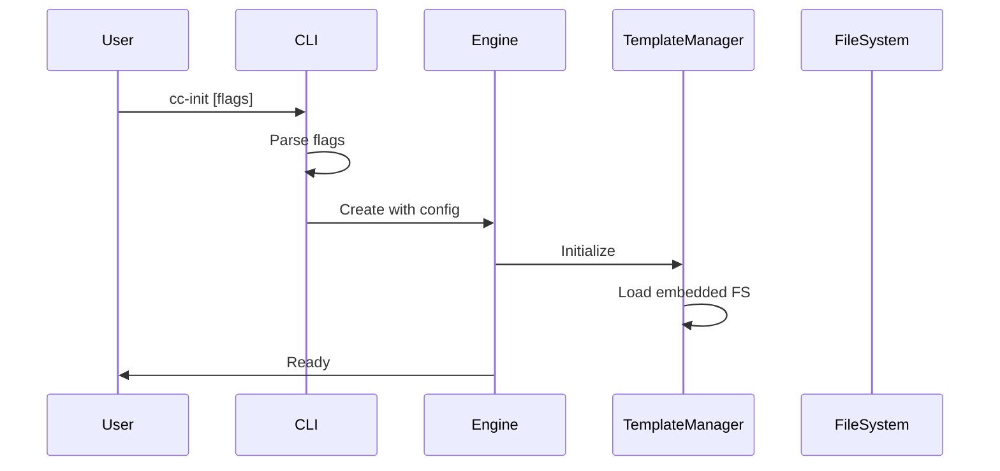
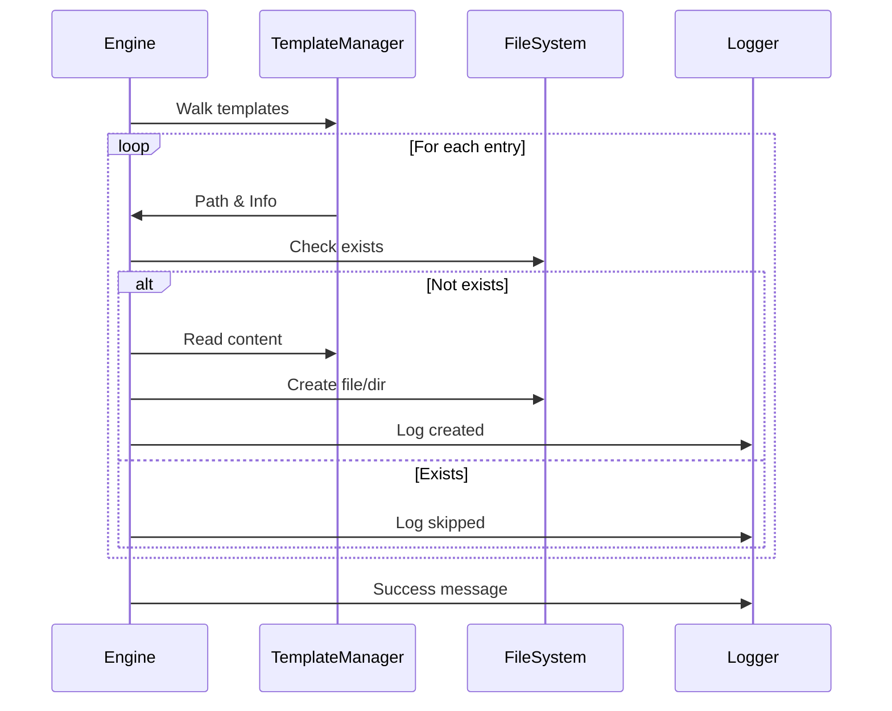

# Technical Design Specification for cc-init

## Architecture Overview

### High-Level Architecture
```
┌─────────────────┐     ┌──────────────────┐     ┌─────────────────┐
│   CLI Layer     │────▶│   Core Engine    │────▶│  File System    │
│  (main.go)      │     │  (engine.go)     │     │   Operations    │
└─────────────────┘     └──────────────────┘     └─────────────────┘
         │                       │                         │
         ▼                       ▼                         ▼
┌─────────────────┐     ┌──────────────────┐     ┌─────────────────┐
│ Command Parser  │     │ Template Manager │     │   OS File I/O   │
│   (cli.go)      │     │ (template.go)    │     │   (fs.go)       │
└─────────────────┘     └──────────────────┘     └─────────────────┘
                                 │
                                 ▼
                        ┌──────────────────┐
                        │ Embedded Assets  │
                        │   (embed.go)     │
                        └──────────────────┘
```

### Component Design

#### 1. Main Entry Point (`main.go`)
```go
package main

import (
    "embed"
    "flag"
    "fmt"
    "os"
)

//go:embed .claude/*
var templateFS embed.FS

func main() {
    config := parseFlags()
    engine := NewEngine(templateFS, config)
    
    if err := engine.Run(); err != nil {
        fmt.Fprintf(os.Stderr, "Error: %v\n", err)
        os.Exit(1)
    }
}
```

#### 2. CLI Configuration (`cli.go`)
```go
// Config holds the CLI configuration
type Config struct {
    TargetDir   string // Target directory for initialization
    DryRun      bool   // Preview operations without making changes
    Verbose     bool   // Enable verbose output
    NoColor     bool   // Disable colored output
    ShowHelp    bool   // Show help information
    ShowVersion bool   // Show version information
}

// parseFlags parses command-line flags and returns the configuration
func parseFlags() *Config {
    // Flag parsing implementation
}

// validateConfig validates the configuration for security and correctness
func validateConfig(config *Config) error {
    // Implementation with security checks
}
```

#### 3. Core Engine (`engine.go`)
```go
// Engine is the core orchestrator for the cc-init tool
type Engine struct {
    templateFS embed.FS      // Embedded template filesystem
    config     *Config       // CLI configuration
    logger     *Logger       // Logging interface
    fs         FileSystem    // File system operations
    tmpl       *TemplateManager // Template management
    stats      Statistics    // Operation statistics
}

// FileSystem defines the interface for file system operations
type FileSystem interface {
    Exists(path string) bool
    CreateDir(path string, perm os.FileMode) error
    CreateFile(path string, content []byte, perm os.FileMode) error
    Walk(root string, fn WalkFunc) error
    Stat(path string) (fs.FileInfo, error)
}

// Run executes the main initialization process with security validation
func (e *Engine) Run() error {
    // Main execution logic with path validation
}
```

#### 4. Template Manager (`template.go`)
```go
// TemplateManager manages the embedded template files
type TemplateManager struct {
    fs     embed.FS // Embedded filesystem
    prefix string   // Template directory prefix
}

// Walk walks through all files in the embedded filesystem with security validation
func (tm *TemplateManager) Walk(fn func(path string, entry fs.DirEntry, err error) error) error {
    // Walk embedded filesystem with path sanitization
}

// ReadFile reads a file from the embedded filesystem after path validation
func (tm *TemplateManager) ReadFile(path string) ([]byte, error) {
    // Read embedded file content with security checks
}

// ValidateTemplatePath ensures template paths are safe
func (tm *TemplateManager) ValidateTemplatePath(path string) error {
    // Security validation implementation
}
```

#### 5. File System Operations (`fs.go`)
```go
type OSFileSystem struct{}

func (fs *OSFileSystem) Exists(path string) bool {
    _, err := os.Stat(path)
    return err == nil
}

func (fs *OSFileSystem) CreateDir(path string, perm os.FileMode) error {
    if fs.Exists(path) {
        return nil
    }
    return os.MkdirAll(path, perm)
}

func (fs *OSFileSystem) CreateFile(path string, content []byte, perm os.FileMode) error {
    if fs.Exists(path) {
        return nil
    }
    return os.WriteFile(path, content, perm)
}
```

## Data Flow

### Initialization Flow


### Execution Flow


## Key Design Decisions

### 1. Embedding Strategy
- Use `//go:embed` directive with wildcard pattern `.claude/*`
- Embed entire directory structure preserving hierarchy
- Access through `embed.FS` interface for consistency

### 2. File System Abstraction
- Define `FileSystem` interface for testability
- Implement `OSFileSystem` for production use
- Enable `MockFileSystem` for unit testing

### 3. Error Handling
- Use wrapped errors with context
- Fail fast on critical errors
- Continue on non-critical errors with logging

### 4. Logging Architecture
```go
type Logger struct {
    verbose bool
    noColor bool
    writer  io.Writer
}

const (
    ColorGreen  = "\033[32m"
    ColorYellow = "\033[33m"
    ColorRed    = "\033[31m"
    ColorReset  = "\033[0m"
)
```

### 5. Path Handling
- Use `filepath` package for cross-platform compatibility
- Always use forward slashes in embedded filesystem
- Convert paths appropriately for target OS
- Implement explicit path validation to prevent directory traversal
- Sanitize all paths before file operations

## Template Structure

### Embedded Directory Layout
```
.claude/
├── commands/
│   ├── ask.md
│   └── spec-workflow.md
├── settings.local.json
└── CLAUDE.md
```

### Path Mapping
- Source: `.claude/commands/ask.md`
- Target: `{targetDir}/commands/ask.md`

## Error Handling Strategy

### Error Categories
1. **Fatal Errors**: Terminate immediately
   - Invalid target directory
   - No write permissions
   - Template loading failure

2. **Recoverable Errors**: Log and continue
   - Individual file creation failure
   - Permission issues on specific files

3. **Warnings**: Log only
   - Existing files/directories skipped

### Error Message Format
```
Error: <category>: <specific message>
  Details: <additional context>
  Suggestion: <actionable advice>
```

## Testing Strategy

### Unit Tests (Required Coverage: 90%+)
```go
// engine_test.go
func TestEngine_Run(t *testing.T) {
    tests := []struct {
        name    string
        fs      FileSystem
        config  *Config
        wantErr bool
    }{
        {"success case", mockFS, validConfig, false},
        {"permission denied", deniedFS, validConfig, true},
        {"invalid target", mockFS, invalidConfig, true},
        // Additional test cases
    }
}

// Security-focused tests
func TestPathValidation(t *testing.T) {
    tests := []struct {
        name      string
        inputPath string
        wantValid bool
    }{
        {"valid relative path", "commands/ask.md", true},
        {"directory traversal attempt", "../../../etc/passwd", false},
        {"absolute path injection", "/etc/passwd", false},
        {"windows traversal", "..\\..\\windows\\system32", false},
    }
}
```

### Required Test Files
- `engine_test.go` - Core engine functionality
- `template_test.go` - Template manager operations
- `fs_test.go` - File system interface implementations
- `cli_test.go` - Command-line parsing and validation
- `logger_test.go` - Logging functionality
- `security_test.go` - Path validation and security tests

### Integration Tests
- Test with real filesystem in temporary directory
- Verify complete template deployment
- Test edge cases (permissions, existing files)
- Test security scenarios with malicious paths

### Embedded FS Testing
```go
//go:embed testdata/.claude/*
var testFS embed.FS

func TestTemplateManager_Walk(t *testing.T) {
    // Test embedded filesystem operations
}
```

### Coverage Requirements
- Minimum 90% code coverage for all packages
- 100% coverage for security-critical functions
- Coverage reporting in CI/CD pipeline

## Performance Considerations

### Optimization Strategies
1. **Parallel Processing**: Process independent files concurrently
2. **Buffered I/O**: Use buffered operations for large files
3. **Early Exit**: Skip directory traversal when all exists
4. **Memory Efficiency**: Stream large files instead of loading fully

### Benchmarking
```go
func BenchmarkEngine_Run(b *testing.B) {
    // Benchmark template deployment
}
```

## Security Considerations

### Path Validation
```go
// ValidatePath ensures the target path is safe and within bounds
func ValidatePath(base, target string) error {
    // Clean and resolve paths
    cleanBase := filepath.Clean(base)
    cleanTarget := filepath.Clean(target)
    
    // Convert to absolute paths
    absBase, err := filepath.Abs(cleanBase)
    if err != nil {
        return fmt.Errorf("invalid base path: %w", err)
    }
    
    absTarget, err := filepath.Abs(cleanTarget)
    if err != nil {
        return fmt.Errorf("invalid target path: %w", err)
    }
    
    // Ensure target is within base directory
    if !strings.HasPrefix(absTarget, absBase) {
        return fmt.Errorf("path traversal detected: %s", target)
    }
    
    return nil
}

// SanitizeTemplatePath removes dangerous elements from template paths
func SanitizeTemplatePath(path string) (string, error) {
    // Reject absolute paths
    if filepath.IsAbs(path) {
        return "", fmt.Errorf("absolute paths not allowed: %s", path)
    }
    
    // Clean the path to resolve . and .. elements
    cleaned := filepath.Clean(path)
    
    // Reject paths that escape the base directory
    if strings.HasPrefix(cleaned, "..") || strings.Contains(cleaned, "/..") {
        return "", fmt.Errorf("directory traversal not allowed: %s", path)
    }
    
    return cleaned, nil
}
```

### File Permissions
- Preserve source permissions where possible
- Default to 0755 for directories
- Default to 0644 for files
- Never set executable bit on data files

## Build and Distribution

### Build Configuration
```makefile
# Makefile
VERSION := $(shell git describe --tags --always --dirty)
LDFLAGS := -X main.version=$(VERSION)

build:
	go build -ldflags "$(LDFLAGS)" -o cc-init

build-all:
	GOOS=darwin GOARCH=amd64 go build -o cc-init-darwin-amd64
	GOOS=linux GOARCH=amd64 go build -o cc-init-linux-amd64
	GOOS=windows GOARCH=amd64 go build -o cc-init-windows-amd64.exe
```

### CI/CD Pipeline
```yaml
# .github/workflows/build.yml
name: Build and Test
on: [push, pull_request]
jobs:
  test:
    strategy:
      matrix:
        os: [ubuntu-latest, macos-latest, windows-latest]
        go: ['1.24.x']
```